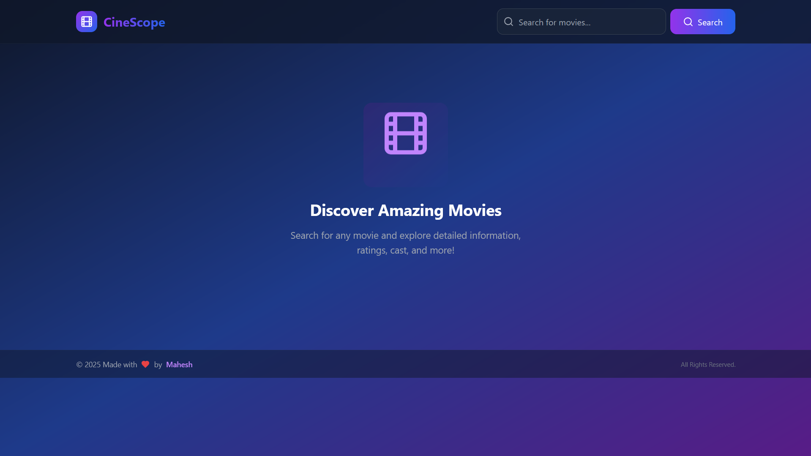
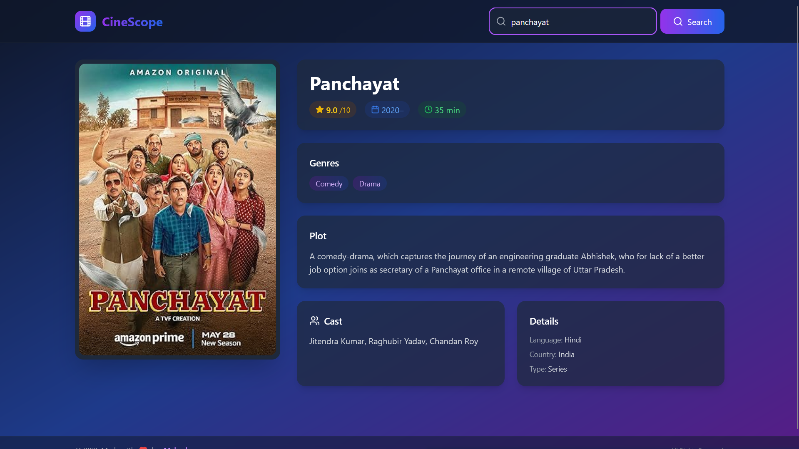

# 🎬 CineScope – A Movie Discovery App

CineScope is a sleek and responsive movie discovery app built using React and Tailwind CSS. It allows users to search for movies and view dynamic results with an engaging UI.

## 🔗 Live Demo

[Visit CineScope](https://cine-scopee.vercel.app/)

## ✨ Features

- Search for movies using keywords
- Fetch real-time movie data from API
- Custom error handling
- Stylish, responsive user interface

## 🛠️ Tech Stack

- React
- Tailwind CSS
- JavaScript (ES6+)
- Movie API

## 🖼️ Screenshots




## 🚀 Installation

### Get Api Key from:

https://www.omdbapi.com/

### Add environment variables

```bash
cp .env.example .env
```

```env
VITE_MOVIE_API_KEY=your_api_key
```

```bash
git clone https://github.com/maheshhattimare/CineScope.git
cd CineScope
npm install
npm start
```

Open [http://localhost:3000](http://localhost:3000) to view it in the browser.

<div align="center">
Made with ❤️ by [Mahesh Hattimare](https://maheshhattimare.vercel.app/) 
</div>
